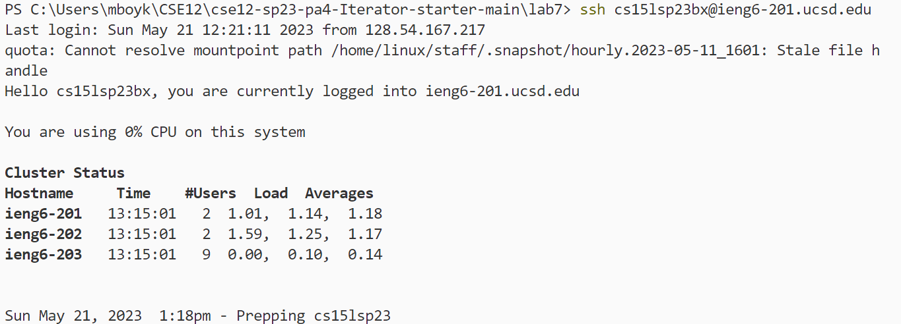
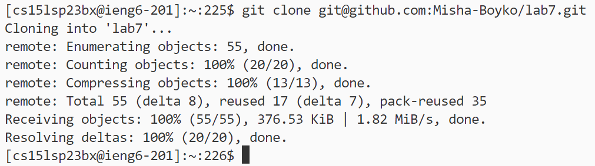
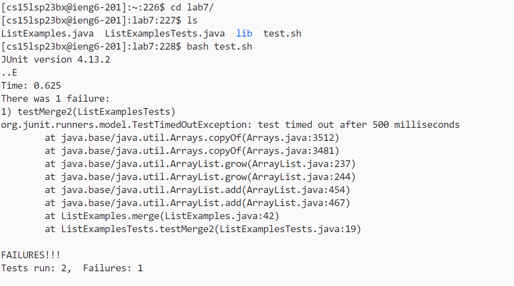
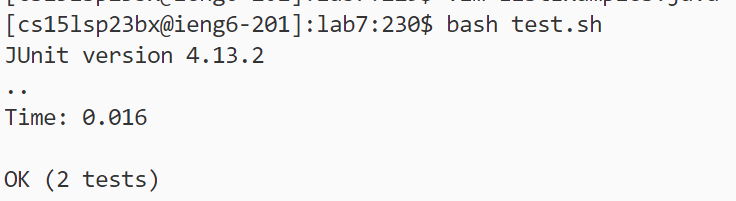
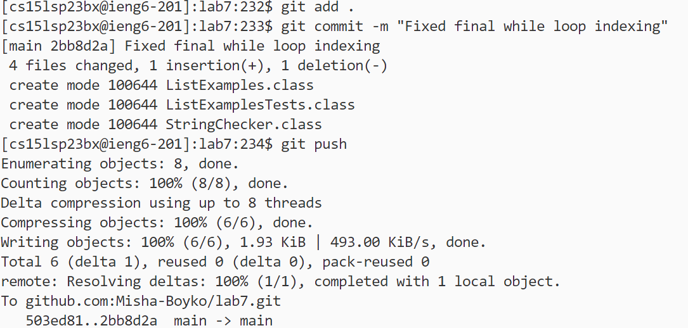

#Lab 4

## The steps I took to edit the file:
The first step I took was to ssh into the lab computer: 
```
ssh cs15lsp23bx@ieng6-201.ucsd.edu
```


I then cloned my fork of the lab7 on github and copy pasted the ssh clone link: 
```
git clone git@github.com:Misha-Boyko/lab7.gitgit@github.com:Misha-Boyko/lab7.git
```

Next I cd into the file I cloned by typing cd l and <tab> to completet the line to cd lab7
```
cd l <tab> <enter>
```
I then run the tests to show that it currently fails before any editing of the file.
I type bash te <tab> which auto compeltes to bash test.sh
```
bash te <tab> <enter>
```

The output shows that the tests failed so we need to edit the ListExamples file.
We edit the file by typing vim ListExamples. <tab> which autocompletes to vim ListExamples.java
```
vim ListExamples. <tab> <enter>
```
The vim terminal opens to the top of the page so we write the following commands to fix the error:
```
42 <enter>
e <enter>
r 2 <enter>
```

After correcting the error we type :wq <enter> to save our changes.
```
:wq <enter>
```
To show that these changes fixed the error we run the tests again:
```
bash te <tab> <enter>
```

Finally now that the changes have been fixed, we add, commit, and push the changes back to our repository:
```
git add . <enter>
git commit -m "Fixed final while loop indexing" <enter>
git push <enter>
```

